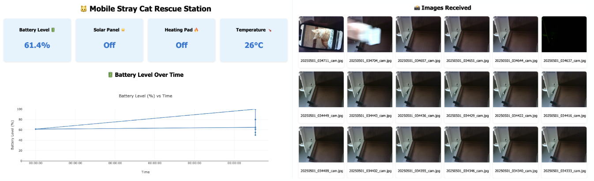

# ECE445_Lab_Notebook
-- Ming -- 

Date: 2/10
-- 

- Worked on Project Proposal.

Date: 2/24
-- 
- Worked on Power PCB with teammates. 

Date: 3/4
-- 
- Worked on the breadboard for breadboard demo.
- Started the coding parts for this.

Date: 3/6
-- 
- Figured out that the esp32 being used is not suitable.
 Configured the general settings for Arduino.

Date: 3/10
-- 
- Finalaized everything for the breadboard. 
- Wifi was succesfully connected
    - Had to change a lot of the Aruduino setting, including the flash size, upload speed, board being used, etc...

Date: 3/20
-- 
- Built the wodden exterior structure. 
- Figured that the angle of the roof matters for the solar panel to absorb sunlight. 

Date: 3/24
-- 
- worked on software development(image processing portion)
- First decided to train my own cat detection model, but realized that YOLO has prebuilt model already.
- Written the code to ultilize the YOLO v8n model, and connected to flask, so that image can be sent to an endpoint.
- Image processing worked on local device.

Date: 4/3
-- 
- Tested the code for image processing on cloud, thought it would work through flask backend, but later found out no signal were able to sent to the backend due to different network connected.
- Decided to swtich over to cloud(more expensive), and decided to use AWS. 

Date: 4/8
-- 
- Completed the AWS connection with the YOLO code that was written, and now everything is able to reach to the backend from anywhere and any wifi connection. 
- Tested by using another computer that is different than what the AWS is being ran on, and image was able to sent through and get a response back. 

Date: 4/11
-- 
- Wanted to connect the backend processing with the camera.
- Tried connecting to the esp32 camera, and so when the camera takes picute, it can be sent to AWS backend. 
- Something went wrong with the connection to backend(realized that the AWS was turned off, and had to be restarted, changed the setting and code, so that it can be ran 24/7)

Date: 4/16
-- 
- Figured out what was wrong with the camera and backend.
- Image processing code works well with the camera(image was able to sent to backend, get detected wether it is a cat or not, and sent a response back)

Date: 4/18
--
- Motor connection, and also weight sensor were placed into the code, worked fine, beside the motor was too slow. 
- Modified the motor and the code for it, so that it dispense the food.
- Set the limit for the weight sensor. 

Date: 4/24
-- 
- Built a website that monitors the result from the ESP32, as well as store images that was sent to backend. 
- Tested to see the accuracy of the AI detection(above 90% accuracy)

