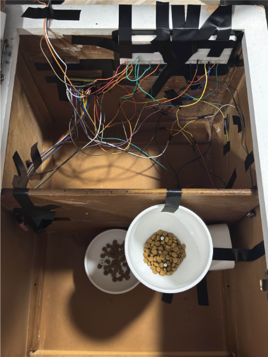

# ECE445_Lab_Notebook
-- Yilin -- 

Date: 2/10
-- 

- Worked on Project Proposal.

Date: 2/24
-- 
- Worked on Power PCB with teammates. 

Date: 3/4
-- 
- Worked on the breadboard for breadboard demo.
- Started the coding parts for this.

Date: 3/6
-- 
- Figured out that the esp32 being used is not suitable.
 Configured the general settings for Arduino.

Date: 3/10
-- 
- Finalaized everything for the breadboard. 
- Wifi was succesfully connected
    - Had to change a lot of the Aruduino setting, including the flash size, upload speed, board being used, etc...
    - Simply implement the logic of wifi connection and motor operation.

Date: 3/20
-- 
- Use breadboard to test the operation of each component and implement it on Arudino.

Date: 3/24
-- 
- Combine the wifi, motor, pressure sensor and distance sensor together to create a virtual input to test the logic of how all the components work together.

Date: 4/3
-- 
- Start to initialize the camera separately, connect to wifi and successfully monitor the real-time image of the camera through the page.
- The Arudino code was adjusted to adjust the image quality of the camera, and the focal length of the camera was adjusted to successfully obtain a clear image.

Date: 4/8
-- 
- Connect all the components and sensors together and edit the final test code. Occasionally it works.

Date: 4/16
-- 
- Solved the problem that multiple sensors occupy GPIO, causing the distance sensor and camera to fail to initialize and work properly.
- When the network signal is normal, the operation of all components will not be restricted and the success rate will reach over 90%.

Date: 4/18
--
- Assemble the 3D printed feeder and add cat food to test the food output.
- Due to the problem of code setting, the motor torque is not large enough, and the motor occasionally gets stuck. Adjust the motor speed to test the most suitable combination. The torque is large enough when the motor can reach a certain speed, and the expectation of grain discharge can be achieved without getting stuck.

